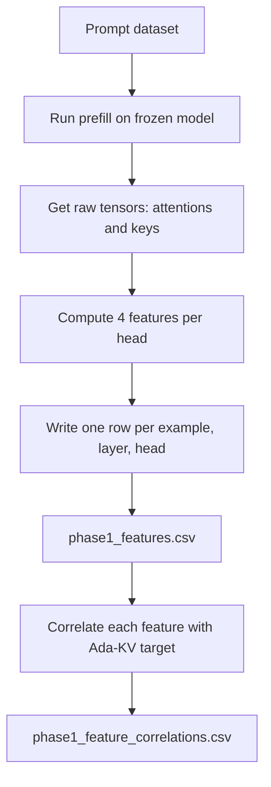
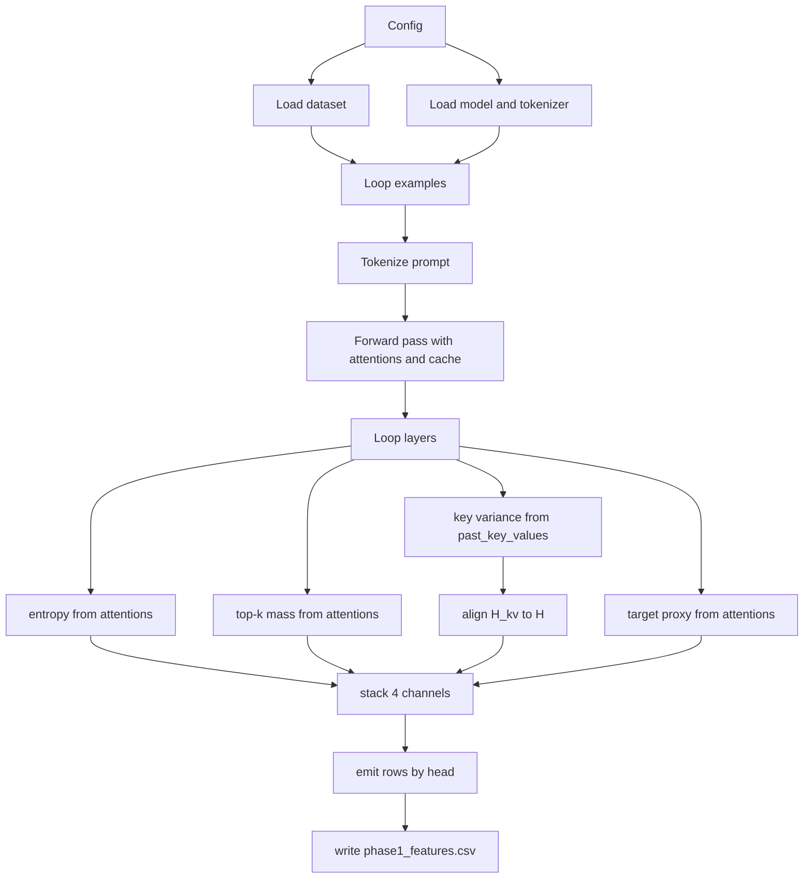
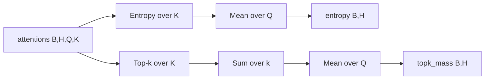
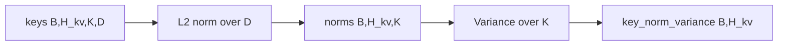
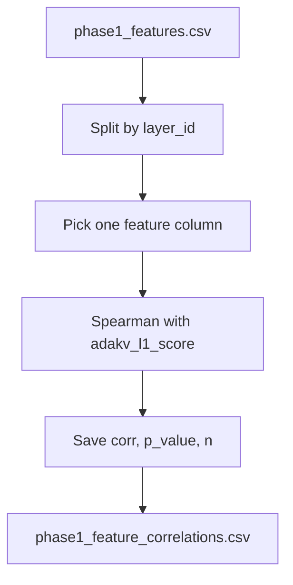

# Phase 1 Feature Extractor - Beginner Walkthrough

If you are new to this area, think of Phase 1 as:

1. **Observe** what each attention head is doing.
2. **Summarize** each head into 4 numbers.
3. **Check** if those numbers relate to Ada-KV's score.

That is all. No RL yet.

---

## What files do what

- `kvpress/kvpress/learned_budget_features.py`
  - Pure feature math functions.
- `kvpress/kvpress/learned_budget_feature_collection.py`
  - Full data collection pipeline: load dataset, run prefill, extract per-layer features, write CSV rows.
- `kvpress/kvpress/learned_budget_phase1_analysis.py`
  - Reads CSV and computes layer-wise Spearman correlation.

---

## Big picture first



---

## Deep dive: `learned_budget_feature_collection.py`

This file is the bridge between raw model tensors and your tabular training data.

### A) Config and dataset mapping

- `Phase1CollectionConfig`
  - Defines dataset, model, output path, max examples, token cap, device.
- `DATASET_REGISTRY` + `resolve_hf_dataset_name(...)`
  - Lets you pass short names like `ruler`, then resolves to HF dataset IDs.

### B) Prompt builder

- `build_prompt_from_example(example)`
  - Tries fields in this order:
    1. `context + question`
    2. `prompt`
    3. `input`
    4. `text`
  - This makes the collector robust across benchmark schemas.

### C) ID handling

- `get_example_id(example, idx)`
  - Uses `id` or `example_id` if present.
  - Falls back to loop index so every row still has a stable ID.

### D) GQA head alignment

- `align_kv_to_attention_heads(kv_tensor, num_attention_heads)`
  - Input is `(B, H_kv)`, but other features use `(B, H)`.
  - If `H > H_kv`, it repeats each KV-head value across grouped query heads.
  - This is required before stacking features into `(B, H, 4)`.

### E) Ada-KV target proxy

- `compute_adakv_target_proxy_from_attentions(attentions, eps)`
  - Current target is a proxy from attentions:
    - take max over keys, then mean over queries
    - output shape `(B, H)`
  - This is practical for Phase 1, but still not exact Ada-KV L1 bound.

### F) Model loading

- `load_prefill_model_and_tokenizer(config)`
  - Loads tokenizer and model once.
  - Sets `pad_token` if missing.
  - Handles device fallback to CPU if CUDA is unavailable.

### G) Main collection loop

`collect_phase1_features(config)` does this:

1. Load dataset split.
2. Load model and tokenizer.
3. For each example (up to `max_examples`):
   - build prompt
   - tokenize with truncation (`max_context_tokens`)
   - run forward pass with:
     - `output_attentions=True`
     - `use_cache=True`
4. For each layer:
   - read `layer_attn` and `layer_keys`
   - compute 4 channels:
     - entropy `(B,H)`
     - top-k mass `(B,H)`
     - key variance `(B,H_kv)` then align to `(B,H)`
     - Ada-KV proxy `(B,H)`
   - stack into `(B,H,4)`
   - emit one CSV row per head
5. Save rows to `phase1_features.csv`.

### H) Output schema

Each row has:

- `example_id`
- `layer_id`
- `head_id`
- `attention_entropy`
- `topk_attention_mass`
- `key_norm_variance`
- `adakv_l1_score`

### I) Local sanity function

- `dryrun_feature_ops()`
  - Generates synthetic tensors and validates final shape `(B,H,4)`.
  - Good first check before expensive model runs.

### J) CLI usage

Run with defaults:

```bash
python -m kvpress.learned_budget_feature_collection
```

Run with overrides:

```bash
python -m kvpress.learned_budget_feature_collection \
  --dataset_name ruler \
  --dataset_config 4096 \
  --model_name Qwen/Qwen2.5-7B-Instruct \
  --max_examples 32 \
  --device cuda:0
```

### K) Code flow diagram



---

## Shape legend in plain language

- `B`: batch size, number of prompts processed together.
- `H`: number of attention heads.
- `H_kv`: number of KV heads (can differ from `H` in GQA models).
- `Q`: query positions.
- `K`: key positions, cache length.
- `D`: head dimension.

Main tensors:

- `attentions`: `(B, H, Q, K)`
  - For each prompt, head, and query token, we have a probability distribution over `K` keys.
- `keys`: `(B, H_kv, K, D)`
  - Key vectors stored in cache.

---

## The 4 features with intuition

### 1) Attention entropy

- Input: `attentions (B, H, Q, K)`
- Output: `(B, H)`
- Intuition:
  - High entropy means attention is spread over many tokens.
  - Low entropy means attention is focused on few tokens.

### 2) Top-k attention mass

- Input: `attentions (B, H, Q, K)`
- Output: `(B, H)`
- Intuition:
  - Measures how much attention is captured by the strongest `k` keys.
  - If this is high, a small subset of keys may already capture most signal.

### 3) Key norm variance

- Input: `keys (B, H_kv, K, D)`
- Output: `(B, H_kv)`
- Intuition:
  - Compute L2 norm per key vector, then variance across positions.
  - High variance means keys differ more in magnitude across tokens.

### 4) Ada-KV L1 score (target side)

- Expected output shape: `(B, H)`
- Intuition:
  - This is the baseline analytical signal you want to compare against.
  - In scaffold it is placeholder zeros, TODO to replace with real Ada-KV extraction.

---

## How shapes change step by step





Then stack channels:

- `build_feature_tensor(ent, topk, var, adakv) -> (B, H, 4)`
- Last dimension is feature channel index:
  - `0`: entropy
  - `1`: top-k mass
  - `2`: key norm variance
  - `3`: Ada-KV score

Note: if `H != H_kv`, you must define a mapping before stacking.

---

## Tiny numeric example

Assume:

- `B=1`, `H=2`, `Q=3`, `K=4`
- After computing features, you get:
  - entropy: `[[1.20, 0.80]]`
  - top-k mass: `[[0.70, 0.55]]`
  - key norm var: `[[0.15, 0.40]]`
  - adakv score: `[[0.60, 0.30]]`

Stacked tensor shape is `(1, 2, 4)`:

- head 0 vector: `[1.20, 0.70, 0.15, 0.60]`
- head 1 vector: `[0.80, 0.55, 0.40, 0.30]`

When written to CSV (for one layer), this becomes two rows:

- `(example_id=..., layer_id=..., head_id=0, ...4 feature columns...)`
- `(example_id=..., layer_id=..., head_id=1, ...4 feature columns...)`

---

## What correlation step is proving

Question:

- "Do these features carry similar ordering information to Ada-KV target scores?"

Process:



Interpretation:

- Positive Spearman means when feature goes up, Ada-KV score tends to go up.
- Near zero means weak monotonic relationship.
- This does not prove causality, only association.

---

## Why this phase exists before allocator training

If features are noisy or uninformative, Phase 2 and Phase 3 become unstable.

So Phase 1 is a guardrail:

- verify feature pipeline works
- verify shapes are correct
- verify features have useful signal

Only then move to allocator integration.

---

## Current TODOs

### In `learned_budget_feature_collection.py`

- Replace target proxy with exact Ada-KV analytical L1 score.
- Add optional batching for speed.
- Add optional progress logging and checkpointed CSV writes.

### In `learned_budget_features.py`

- Finalize top-k definition.
- Define `H` to `H_kv` alignment for GQA.

### In `learned_budget_phase1_analysis.py`

- Optional deeper diagnostics if needed.

---

## Quick self-check before Phase 2

- CSV is non-empty.
- No NaN in features.
- Layer-wise correlations are computed without errors.
- Head mapping policy (`H` vs `H_kv`) is explicitly written down.
